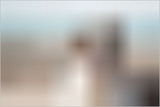

# Low Quality Image Placeholders

_Low Quality Image Placeholder_ is a technique to give users a preview of the image while it is loading. This addon supports different types, all with their own tradeoffs. Based on the cute dog you saw above, you can see here how these different techniques will look like.

See the [Webpack Configuration](./packages/webpack/README.md#configuration) section for how to configure these.

## Color

This is the most basic technique, calculating the dominant color of the image, and setting it as the background color of the images while it loads.
The "cost" is basically 7bytes, for the hex code of the color.

TODO: add import example!

See the [Webpack Configuration](./packages/webpack/README.md#configuration) section for how to configure this.

## Inline image

This creates a very small thumbnail of the original image, wraps it into a SVG and applies a blurry filter. This is then
set as a base64 encoded data-URL as the background of the image while it loads. The example below consumes 348 bytes (uncompressed).

TODO: add import example!

See the [Webpack Configuration](./packages/webpack/README.md#configuration) section for how to configure this.

## BlurHash

[BlurHash](https://blurha.sh/) is an encoding algorithm and library, dedicated for the very purpose of generating nice looking blurry placeholders, without the
overhead of a real image format, which was never optimized for that kind of _tiny_ images. This example consumes just 40 bytes (uncompressed).

TODO: add import example!

But the tradeoff here is that it needs a runtime library for decoding, which takes about 4.7KB (1.9KB compressed). Therefore it
is less suited if you have just a few images, but shines if you need placeholders for a lot!
